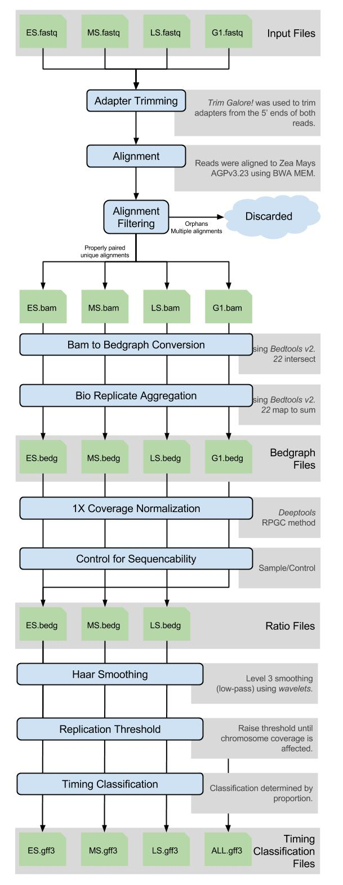

# Repliscan - Logfold Reptiming Pipeline
Pipeline for calculating Repli-seq enrichment and classifying the time replication took place.

## Dependencies
The following binaries need to exist on the user's PATH:

1. bedtools - https://github.com/arq5x/bedtools2
   
   From Stampede/Lonestar @ TACC
   ```
   $ module load bedtools
   ```
2. samtools - https://github.com/samtools/samtools
   
   From Stampede/Lonestar @ TACC
   ```
   $ module load samtools
   ```
3. wavelets - http://staff.washington.edu/dbp/WMTSA/NEPH/wavelets.html
   
   Now provided with Repliscan
4. python

   From Stampede @ TACC
   ```
   $ module load python
   ```

## Installation

Install Repliscan
```
pip install --user git+https://github.com/zyndagj/repliscan.git
```

Add Repliscan to $PATH
```
export PATH=${PATH}:$HOME/.local/bin
```
Add this line to `$HOME/.profile` or `$HOME/.bashrc` to make this permanent.

## Methods



## Running the Pipeline

### Usage
```
repliscan.py [-h] -r FASTA [-l INT] [-w INT] [-a STR] [-t STR] [-S STR]
             [-v FLOAT] [--prep FLOAT] [-c STR] [-R STR] [--pcut FLOAT]
             [--log] [-f] [--plot] FILE
```

### Input TXT - FILE
Each line of the text file needs to contain a short name describing the sample and then a list of bam files corresponding to that name, all separated by *tabs*.

For example:

```
EX	example_rep_1.bam	example_rep_2.bam
```

The first line of this file needs to be the control (G1). All subsequent lines need to be listed sequentially according to experimental time. An example file would be:

```
G1	G1_001.bam	G1_002.bam
ES	ES_001.bam
MS	MS_001.bam	MS_L1.bam	MS_L2.bam
LS	LS.bam
```

When a G1 control is not produced in a Repli-seq experimental protocol as in the two examples below, a total-S can be synthesised from inside the input as shown. Just make sure that you aggregate these "replicates" using a sum opperation (`-a`).

```
G1	ES.bam	MS.bam	LS.bam
ES	ES.bam
MS	MS.bam
LS	LS.bam
```

### Arguments

| Flag | Option | Description - Bold denotes Default|
|:----:|:------:|:------------|
|-r, --ref|**FASTA**|Reference fasta|
|-l,--level|INT|Haar smoothing level \[1,2,**3**,4,5\]|
|-w, --window|INT|Analysis bin size in base pairs - **1000**|
|-a, --aggregate|STR|Replicate agregation method \[**sum**, median, mean, min, max\]|
|-t, --threshold|STR|Replication threshold method \[value, **auto**, percent\]|
|-v, --value|Float|Explicit replication threshold value \[1.0\] when using `-t value`|
|--prep|Float|Remove the lowest \[2.0\]% of singal as noise when using `-t percent`|
|-S,--scope|STR|Replication scope \[**chromosome**, genome\]|
|-c, --classifier|STR|Segmentation classification method \[binary, **proportion**\]|
|-R, --remove|STR|Outlying data to remove \[none, sqrtGamma, lognGamma, **norm**, whiskers, percentile\]|
|--pcut|FLOAT|Remove the upper and lower [2.5]% of the data when using `-R percentile`|
|--log| |Apply log transform to sequenceability ratio|
|-f, --force| |Force the re-generation of all files|
|--plot| |Plot Statistics|
|  |FILE| A text file listing bams for input ***Required***|

### Sequencability Method
- `default` - \(sample/control\)
- `--log` - log\(sample/control\)

### Normalization Methods
- `DESeq` - DESeq size normalization using geometric mean.
- `Coverage` - Transform each sample to 1X coverage across the genome. This replicates the RPGC normalization method from deepTools.

### Replication Methods
- `value` - A signal ratio above threshold `-v` is considered replicating.
- `auto` - Determine a signal ratio threshold unique to each chromosome based on change in coverage.
- `percent` - Signal ratio values for each chromosome above percentile `-p` are considered replicating.

### Segmentation Methods
- `binary` - Time classifications are combined on a binary basis.
- `proportion` - Time classifications are determined based on proportion.

### Handling Replicates
If you have replicates in your input file,
```
MS	MS_001.bam	MS_L1.bam	MS_L2.bam
```
you can specify the method by which they are aggregated with the `-a` paramter. This accepts the following methods:
  - sum (Default)                                    
  - median                                           
  - mean                                             
  - min                                              
  - max                                              

## Output
 - `[replicate].bed` - Bed files produced from corresponding bam
 - `[replicate].bedgraph` - Bedgraph produced from corresponding bed
 - `[replicate]_norm.bedgraph` - Normalized bedgraph produced from corresponding bed
 - `[time].bedgraph` - Aggregated signal from replicates
 - `[time]_norm.bedgraph` - Normalized aggregated signal from replicates
 - `[time]_(logFC|ratio).bedgraph` - Ratio signal when each time is normalized for sequenceability
 - `[time]_(logFC|ratio)_*.smooth.bedgraph` - Ratio signal smoothed using a specified level of Haar wavelet
 - `[time]_(logFC|ratio)_*.smooth.gff3` - GFF showing replicating regions
 - `(logFC|ratio)_segmentation.gff3` -  Segmentation GFF, which can be used as input for `RATrap.py`

## Example Results

To demonstrate the general applicability of repliscan we demonstrate its usage on two previously published datasets. We require that the following software be installed when not running at TACC.

- bedtools
- samtools
- bwa
- python
- [wavelets](http://staff.washington.edu/dbp/WMTSA/NEPH/wavelets.html)
- repliscan

### Lubelsky et al.

The continuous, LOESS smoothed results of [Lubelsky et al.](https://www.ncbi.nlm.nih.gov/pmc/articles/PMC4079966/) were replicated and also run with Repliscan. These methods can be replicated by downloading the following files:

- [README.txt](https://de.cyverse.org/anon-files/iplant/home/gzynda/public/lubelsky2014_replicate/README.txt)
- [lubelsky2014.csv](https://de.cyverse.org/anon-files/iplant/home/gzynda/public/lubelsky2014_replicate/lubelsky2014.csv)
- [replicate_continuous.sh](https://de.cyverse.org/anon-files/iplant/home/gzynda/public/lubelsky2014_replicate/replicate_continuous.sh)

These results can also be immediately viewed by downloading and loading this pre-generated IGV session. Please right-click and "save as", and then "Open [the] session" in IGV.

[lubelsky_dmel_IGV.xml](https://de.cyverse.org/anon-files/iplant/home/gzynda/public/lubelsky2014_replicate/lubelsky_dmel_IGV.xml)

### Hansen et al.

The whole-genme replicating timing profile of [Hansen et al.](https://www.ncbi.nlm.nih.gov/pmc/articles/PMC2806781/) was first replicated, and then compared against the timing profile generated by Repliscan. These methods can be replicated by downloading the following files:

- [hansen_replicate.sh](https://de.cyverse.org/anon-files/iplant/home/gzynda/public/hansen2010_replicate/hansen_replicate.sh)

These results can also be immediately viewed by downloading and loading this pre-generated IGV session. Please right-click and "save as", and then "Open [the] session" in IGV.

[hansen_hg19_IGV.xml](https://de.cyverse.org/anon-files/iplant/home/gzynda/public/hansen2010_replicate/hansen_hg19_IGV.xml)

## Helper Scripts

As our lab continues to utilize Repliscan for our analyses, we have developed scripts to aid subsequent analysis.

### Comparing replication between experiments

Highlights **R**egions of **A**ltered **T**iming betwen replican experiments of the same genome.

```
usage: RATrap.py [-h] [-d FLOAT] [-S INT] -A GFF3 -B GFF3 [-T STR] -F FASTA
                 [-O BEDG] [--stats] [--fig EXT] [--diff]

Finds the timing differences between two segmentation profiles.

optional arguments:
  -h, --help  show this help message and exit
  -d FLOAT    Minimum distance to be RAT (Default: 0.5)
  -S INT      Tile Size (Default: 1000)
  -A GFF3     First Segmentation Profile (mitotic)
  -B GFF3     Second Segmentation Profile (endo)
  -T STR      Times (Default: ES,MS,LS)
  -F FASTA    Reference
  -O BEDG     Output to bedgraph file
  --stats     Generate stats and figures
  --fig EXT   Figure type (Default: pdf)
  --diff      Print fraction different and exit
```

### Merging regions of alterted timing

Merges output from `RATrap.py` to simplify interpretation.

```
usage: mergeRATs.py [-h] [-z INT] [-d FLOAT] [--same] [--greedy] BEDG

Merge RATs from RATrap output

positional arguments:
  BEDG        RATrap.py output bedgraph

optional arguments:
  -h, --help  show this help message and exit
  -z INT      Merge regions separated by [0] bp of zero diff
  -d FLOAT    Differences in the same +/- direction that are smaller than '-d'
              will be merged [0.0]
  --same      Only merge regions of the same time classification
  --greedy    Merge small regions into larger ones
```
